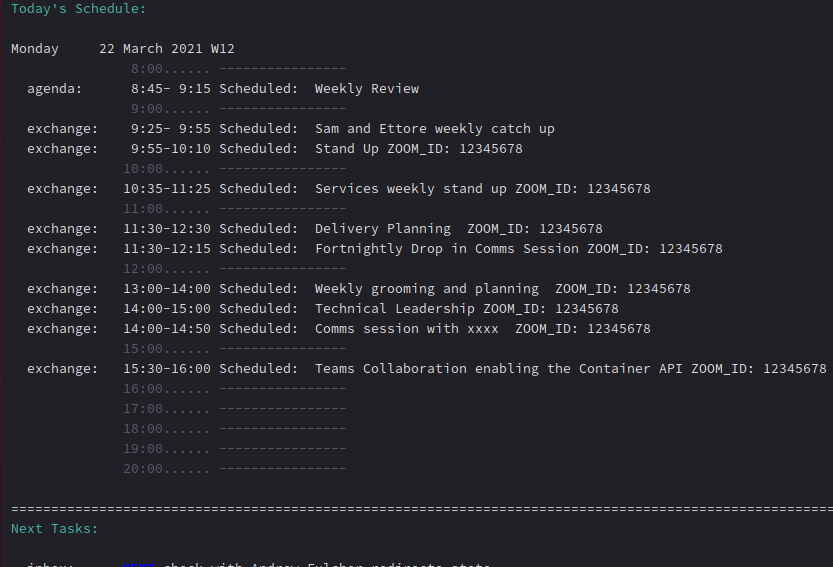

# Organised Exchange
A script to import Exchange `ics` calendars in Org Agenda

## Rationale
In the last year my days have been bombarded of meetings. I wanted to keep track of them on my Org Agenda without the complexities of setting up an account using Davmail or similar solution.

My check-list was:
- [x] Simple to setup
- [x] Meetings should nicely mix up with my normal schedules in Org Agenda
- [x] Read only, I can put a meeting in the calendar directly on Outlook
- [x] Show the Zoom link

## Usage

Set envs vars:

```
$ env | grep ORGANISED_EXCHANGE
ORGANISED_EXCHANGE_ORIGIN=/location/for/your/calendar.ics
ORGANISED_EXCHANGE_DESTINATION=/target/org/file/exchange.org
```

Then you can simply run:

```
$ bin/exchange_to_org
```


## Publishing your Exchange Calendar

In Order to have an up to date ics calendar from your Office 365 account you can:
1. Go to **Outlook Settings**
2. View all Outlook settings
3. the select **Calendar** on the left hand side
4. Select **Shared calendars**
5. Select and publish your calendar

This produces a link to your ics file, be careful! your calendar is now just protected by obfuscation, please consider if this is acceptable for your use case.

We are almost there! Just curl the ics file and import it in Emacs:
```
$ curl https://outlook.office365.com/owa/calendar/[....]/calendar.ics > $ORGANISED_EXCHANGE_ORIGIN
$ bin/exchange_to_org
```

Make sure your `org-agenda-files` includes the file you set for `$ORGANISED_EXCHANGE_DESTINATION` and Voila! Your Org Agenda will now show your Exhange meetings!



## Requirements

Ruby 2.x

## TODO

- [ ] Sync directly from Emacs
- [ ] A Docker image
- [ ] Make the Zoom link optional


## Contributing

Want to help? Great!
1. Fork it (<https://github.com/ettomatic/organised-exchange/fork>)
2. Create your feature branch (`git checkout -b my-new-feature`)
3. Commit your changes (`git commit -am 'Add some feature'`)
4. Push to the branch (`git push origin my-new-feature`)
5. Create a new Pull Request
